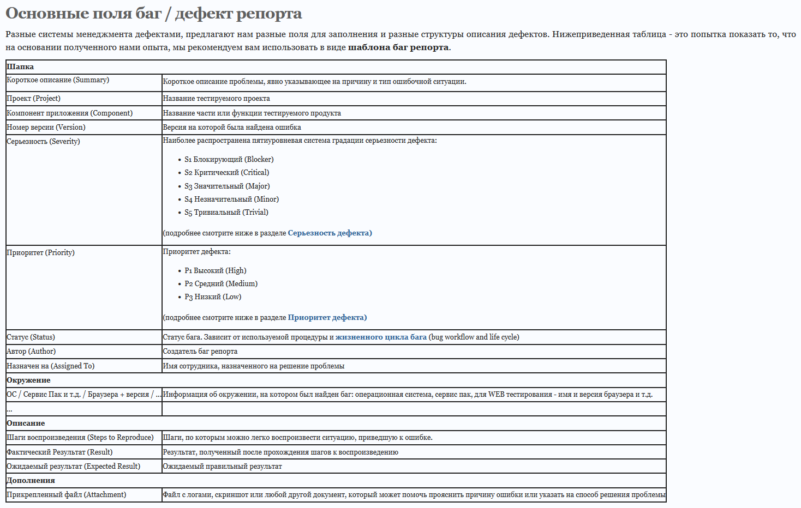

<a id="go"></a>

# **GIT Homework 1**

### --> **[New.json](#new.j)** <--

### --> **[Preferences.jeson](#preferences.j)** <--

### --> **[Skills.jeson](#skills.j)** <--

### --> **[Bug_report.json](#bug_report.j)** <--

## **JSON**

1.  Создать внешний репозиторий c названием JSON:

```
  New > Name > public > Add a README file > Create repository
```

2.  Клонировать репозиторий JSON на локальный компьютер:

```
git clone /pathname
```

3.  Внутри локального JSON создать файл “new.json”:

```
touch new.json
```

4.  Добавить файл под гит:

```
git add new.json
```

5.  Закоммитить файл:

```
git commit -m "text"
```

6.  Отправить файл на внешний GitHub репозиторий:

```
git push
```

7.  Отредактировать содержание файла “new.json” - написать информацию о себе (ФИО, возраст, количество домашних животных, будущая желаемая зарплата). Всё написать в формате JSON:

```

```

8.  Отправить изменения на внешний репозиторий:

```
git add new.json, git commit -m"text", git push
```

9.  Создать файл preferences.json:

```
touch preferences.json
```

10. В файл preferences.json добавить информацию о своих предпочтениях (Любимый фильм, любимый сериал, любимая еда, любимое время года, сторона которую хотели бы посетить) в формате JSON:

```
+
```

11. Создать файл sklls.json добавить информацию о скиллах которые будут изучены на курсе в формате JSON:

```
touch sklls.json
```

12. Сделать коммит в одну строку:

```
git commit -am "text"
```

13. Отправить сразу 2 файла на внешний репозиторий:

```
git push
```

14. На веб интерфейсе создать файл bug_report.json:

```
bug_report.jsonl > Edit this file > New text in bug_report.json
```

15. Сделать Commit changes (сохранить) изменения на веб интерфейсе:

```
Commit message > Commit changes
```

16. На веб интерфейсе модифицировать файл bug_report.json, добавить баг репорт в формате JSON:

```
bug_report.xml > Edit this file > New text in bug_report.xm
```

17. Сделать Commit changes (сохранить) изменения на веб интерфейсе:

```
Commit message > Commit changes
```

18. Синхронизировать внешний и локальный репозиторий JSON:

```
git pull
```

<a id="new.j"></a>

[в начало](#go)

## **New.json**

```
{
        "questionnaire": [
                {
                "Full name":{
                        "last name":"Dovzshenko",
                        "First name":"Senya"
                },
                "Other":{
                        "Age":52,
                        "Number of pets":2,
                        "Salary":"$3000"
                }
        }
        ]
}
```

<a id="preferences.j"></a>

[в начало](#go)

## **Preferences.jeson**

```
{
    "Язык":
    {
        "RU":
        {
            "Анкета":
            {
                "Фильм":"Аватар",
                "Сериал":"Полицейский с Рублёвки",
                "Еда":"Арбуз, виноград",
                "Время года":"Лето",
                "Страна":"Индия, Камбоджи"
            }
        }
    },
    "Language":
    {
        "EN":
        {
            "preferences":
            {
                "Films Darling":"Avatar",
                "Series Darling":"Policeman from Rublyovka",
                "Season Darlin":"Summer",
                "country to visit":"India, Cambodia"
            }
        }
    }
}
```

<a id="skills.j"></a>

[в начало](#go)

## **Skills.jeson**

```
{
    "Skills":
    {
        "Course program":
        {
            "Base theory":
            {
                "x":"Что такое тестирование, багрепорты, документация, виды, методы, направления тестирования и т.п. SDLC, ST Снятие и чтение логов c внешнего сервера",
                "x":"Командная строка (terminal) Linux (копирование, создание, просмотр, перемещение файлов на серверах без графического интерфейса)",
                "x":"Основы bash скриптинг, автоматизация рутинных задач на сервере",
                "x":"Что такое JSON, XML. Их структура"
            }
        },
            "HTTP":
        {
            {
                "x":"HTTP Методы запросов на сервер",
                "x":"Структуры HTTP запросов и ответов",
                "x":"Снифинг http web трафика через Charles и Fiddler"
            }
        },
            "Testing":
        {
            {
                "x":"Тестирование API через Postman JS, автотесты API",
                "x":"Нагрузочное тестирование в Jmeter",
                "x":"Мобильное тестирование"
            }
        },
            "Mobail":
        {
            {
                "x":"Особенность iOS, Android, гайдлайны",
                "x":"Сборка iOS приложений на XCode. (У кого нет Mac компьютера, просто посмотрят)",
                "x":"ADB (управление андройд девайсами)",
                "x":"Сборка Android приложений на Android Studio",
                "x":"Настройка прокси и vpn на iOS и Android",
                "x":"Перехват (сниффинг) мобильного трафика через Charles и Fiddler на iOS и Android"
            }
        },
            "Database":
        {
            {
                "x":"База данных Postgres (установка, настройка и использование)",
                "x":"Нереляционная база данных Redis (установка, настройка и использование)",
                "x":"Основы SQL (Create, Delete, Drop, Insert Into, Select, From, Where, Join)"
            }
        },
            "Server":
        {
            {
                "x":"Что такое клиент-серверная архитектура",
                "x":"Доступ к удалённым серверам",
                "x":"Прочее Снятие и чтение логов c внешнего сервера"
            }
        },
            "Others":
        {
            {
                "x":"Dev Tools веб браузеров (Google Chrome, FireFox)",
                "x":"VPN. (Как работает, зачем нужен, как использовать, варианты инструментов)",
                "x":"Методология разработки Scrum",
                "x":"Техники тест-дизайна (Классы эквивалентности, граничные значения, комбинаторные техники (Попарный, ортогональный, базовый выбор, каждый выбор), состояния и переходы)",
                "x":"Python. (Изучение основ. Создание клиент серверного приложения)"
            }
        }
    }
}

```

<a id="bug_report.j"></a>

[в начало](#go)

## **Bug_report.json**



[в начало](#go)
